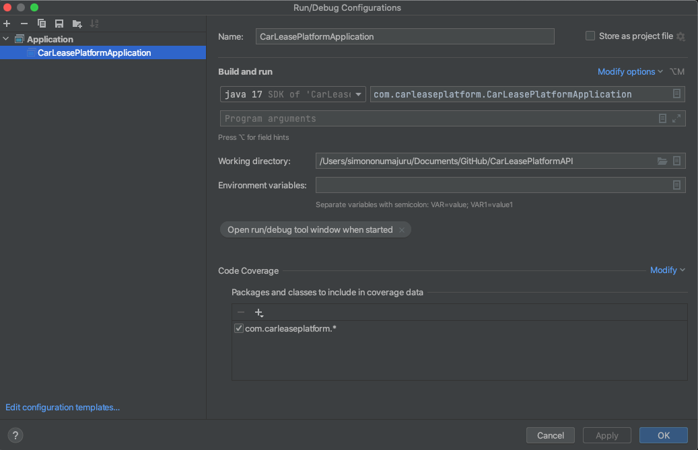

# Read Me First
The following was discovered as part of building this project:

* The original package name this project uses 'com.carleaseplatform'.

# Getting Started

### Reference Documentation
For further reference, please consider the following sections:

* [Official Apache Maven documentation](https://maven.apache.org/guides/index.html)
* [Spring Boot Maven Plugin Reference Guide](https://docs.spring.io/spring-boot/docs/2.7.4/maven-plugin/reference/html/)
* [Create an OCI image](https://docs.spring.io/spring-boot/docs/2.7.4/maven-plugin/reference/html/#build-image)
* [Spring Web](https://docs.spring.io/spring-boot/docs/2.7.4/reference/htmlsingle/#web)
* [Spring Data JPA](https://docs.spring.io/spring-boot/docs/2.7.4/reference/htmlsingle/#data.sql.jpa-and-spring-data)

### Guides
The following guides illustrate how to use some features concretely:

* [Building a RESTful Web Service](https://spring.io/guides/gs/rest-service/)
* [Serving Web Content with Spring MVC](https://spring.io/guides/gs/serving-web-content/)
* [Building REST services with Spring](https://spring.io/guides/tutorials/rest/)
* [Accessing Data with JPA](https://spring.io/guides/gs/accessing-data-jpa/)

# CarLeasePlatformAPI
The Car-lease Platform API is a REST API that allows to maintain vehicle versions, customers and other data needed to service a broker. The end-users of the Car-lease Platform API are: • Brokers that calculate the leaserate for a customer and maintain customer data. • Leasing company that maintains data to make an accurate calculation

## Dependencies used

- Spring Web
- Spring Boot 2.7.4
- H2 In-memory Database 
- Lombok 
- Spring Data JPA 
- Spring Security 
- Tomcat Embed 9.0.14 
- JUnit 4.12 
- Maven 3 
- Java 17

## Running the API & Project

To run the project go to file: "CarLeasePlatformApplication" and hit the run button.
or follow set up image below

The API works by downloading the repository in github, and launching / running with any Java IDE
IDE used (Intellij IDEA). The main API calls are the CRDU operation (Create-Read-Delete-Update)
- Start/Run the project main file = 'CarLeasePlatformApplication' then you can check for the API calls by calling one of the following 
- For testing Customers
  - (GET)
    - http://localhost:8080/customers/
  - (Post)
    - http://localhost:8080/customers/
  - (Update)
    - http://localhost:8080/customers/1
  - (Delete)
    - http://localhost:8080/customers/1
- Same goes for the Car

## NOTE:
The request are/were made using postman for testing since there is no UI for login in. Also, before any subsequent call can be made user have to login in this case default 2 dummy users are beeing set in the CarLeaseSecurityConfig 
- User 1: (User: simon, Password: admin)
- User 2: (User: admin, Password: admin)